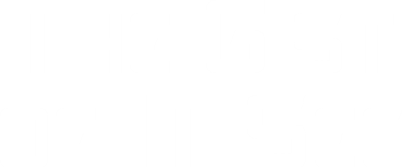
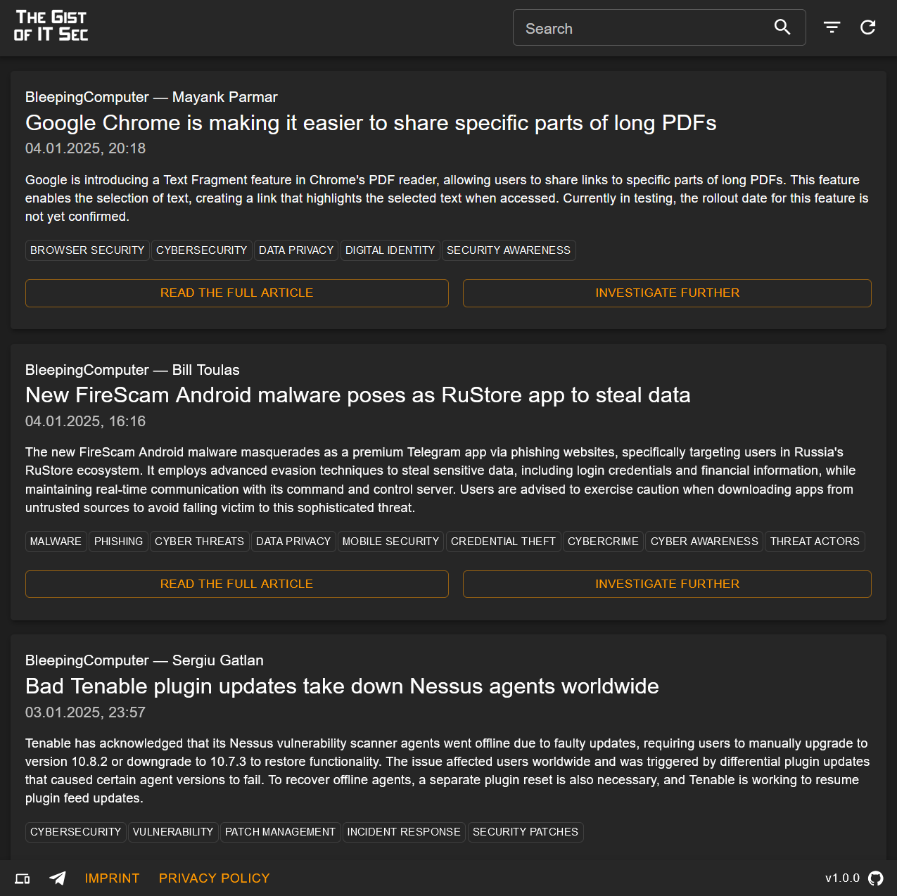

[](https://gist.pkemkes.de/) 

[](https://github.com/pkemkes/the-gist-of-it-sec/releases/latest)
[](https://github.com/pkemkes/the-gist-of-it-sec/actions/workflows/build-and-push.yml)
[](https://github.com/pkemkes/the-gist-of-it-sec/blob/main/LICENSE.md)

[](https://github.com/pkemkes/the-gist-of-it-sec/actions/workflows/test-and-deploy-coverage.yml)
[](https://pkemkes.github.io/the-gist-of-it-sec/)
[](https://pkemkes.github.io/the-gist-of-it-sec/)

[](https://github.com/pkemkes/the-gist-of-it-sec)

----

The Gist of IT Sec aggregates multiple RSS feeds, parses their entries, generates short summaries ("gists") using OpenAIs ChatGPT and collects those in a sleek web UI. A Telegram Bot can also easily be set up that sends a short message to each registered user for every new RSS feed entry.

The web UI furthermore offers the feature to quickly find similar gists using the LLM embeddings.

[](./assets/screenshot.png)

# Live version

The newest version is always deployed and can freely be used under the following URL: https://gist.pkemkes.de

# Setup

If you want to setup the system yourself, you can modify the [docker-compose.yaml](./docker-compose.yaml) that is used for local development. The production deployment is almost identical (look for "NOTE" remarks in the comments of the file).

The newest docker containers are always automatically built and pushed to https://hub.docker.com/u/pkemkes.

# MCP Server

The project includes an MCP (Model Context Protocol) server that exposes the backend API as tools for AI assistants. Once the stack is running, the MCP server is available at:

```
http(s)://<your-host>/mcp
```

To connect from an MCP-compatible client (e.g. VS Code, Claude Desktop, or Claude Code), add the server URL using Streamable HTTP transport. For example, in Claude Code:

```bash
claude mcp add --transport http the-gist-of-it-sec http(s)://<your-host>/mcp
```

Or in your VS Code `settings.json`:

```json
{
    "mcp": {
        "servers": {
            "the-gist-of-it-sec": {
                "type": "http",
                "url": "http(s)://<your-host>/mcp"
            }
        }
    }
}
```

# License

This project is released under the [PolyForm Noncommercial License 1.0.0](./LICENSE.md). Commercial use is not permitted.

The licenses of other third-party libraries used in this project can be found in [NOTICE](./NOTICE.md).